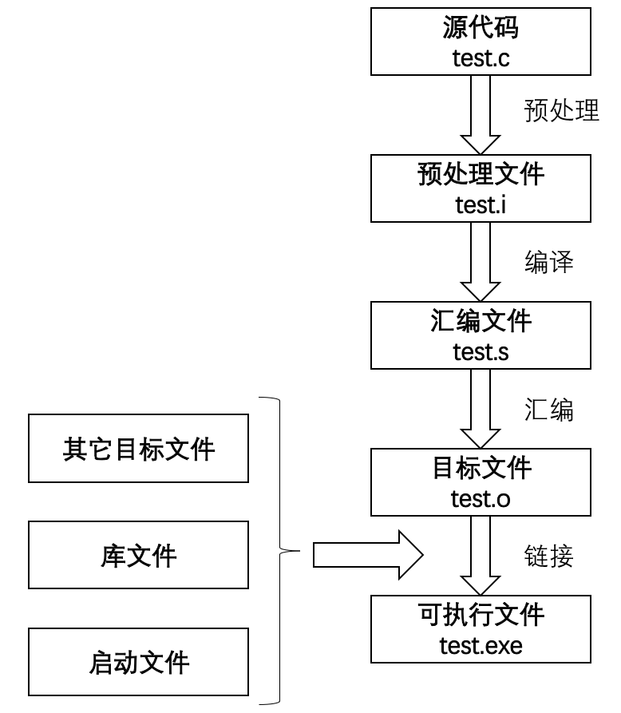
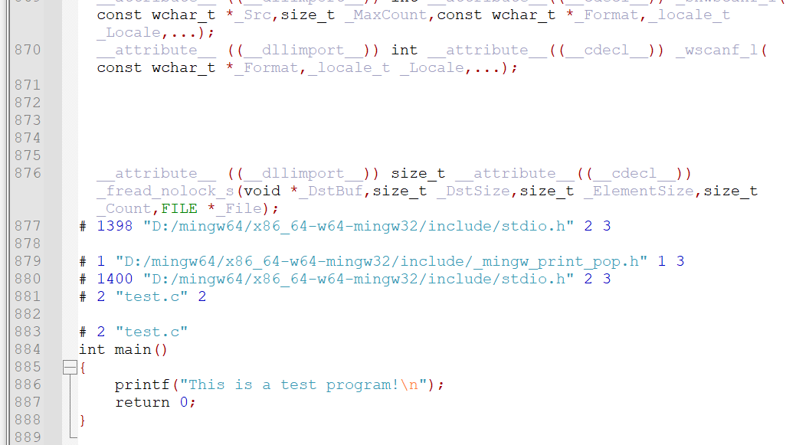
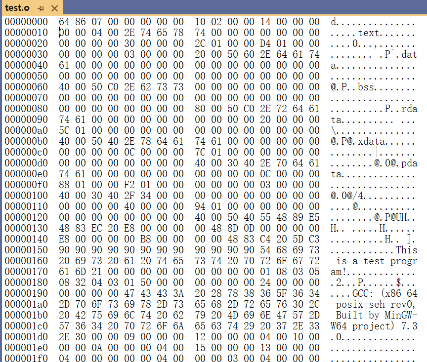

# <center>C文件编译</center>

## 前言

如下代码从源代码到可执行文件经历了哪些过程吗。仅仅是编译吗？

```c
#include <stdio.h>
int main(void)
{ 
    printf("This is a test program!\n");
    return 0;
}
```

## 流程

流程如下：



编译生成可执行文件的过程实际包含四个过程：
* 预处理
* 编译
* 汇编
* 链接

### 1、预处理（Preprpcessing）

使用预处理器把源文件test.c经过预处理生成test.i文件，预处理用于将所有的#include头文件以及宏定义替换成其真正的内容。
预处理的命令为：

```c
gcc -E test.c -o test.i
```

上述命令中-E是让编译器在预处理之后就退出，不进行后续编译过程；-o是指定输出文件名。
预处理之后得到的仍然是文本文件。test.i文件内容如下：



### 2、编译（Compilation）

使用编译器将预处理文件test.i编译成汇编文件test.s。
编译的命令为：

```c
gcc -S test.i -o test.s
```

上述命令中-S让编译器在编译之后停止，不进行后续过程；-o是指定输出文件名。汇编文件test.s是文本文件，内容如下：

```c
	.file	"test.c"
	.text
	.def	__main;	.scl	2;	.type	32;	.endef
	.section .rdata,"dr"
.LC0:
	.ascii "This is a test program!\0"
	.text
	.globl	main
	.def	main;	.scl	2;	.type	32;	.endef
	.seh_proc	main
main:
	pushq	%rbp
	.seh_pushreg	%rbp
	movq	%rsp, %rbp
	.seh_setframe	%rbp, 0
	subq	$32, %rsp
	.seh_stackalloc	32
	.seh_endprologue
	call	__main
	leaq	.LC0(%rip), %rcx
	call	puts
	movl	$0, %eax
	addq	$32, %rsp
	popq	%rbp
	ret
	.seh_endproc
	.ident	"GCC: (x86_64-posix-seh-rev0, Built by MinGW-W64 project) 7.3.0"
	.def	puts;	.scl	2;	.type	32;	.endef
```

### 3、汇编（Assemble）

使用汇编器将汇编文件test.s转换成目标文件test.o。
汇编过程的命令为：

```c
gcc -c test.s -o test.o
```

上述命令中-c、-o让汇编器把汇编文件test.s转换成目标文件test.o。目标文件test.o是二进制文件，内容如下：



### 4、链接（Linking）

链接过程使用链接器将该目标文件与其他目标文件、库文件、启动文件等链接起来生成可执行文件。
链接过程的命令为：

```c
gcc test.o -o test.exe
```

综上，全部命令如下：

```c
gcc -E test.c -o test.i
gcc -S test.i -o test.s
gcc -c test.s -o test.o
gcc test.o -o test.exe
```

可简化为：
```c
gcc -c test.c -o test.o
gcc test.o -o test.exe
```