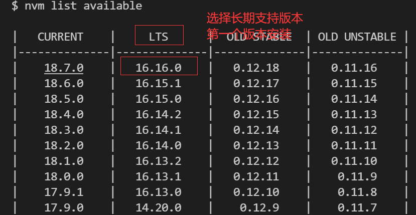

## 1、插件

**1. Emmet**
* 快速生成模板  
  
$\Downarrow$
```html
<!DOCTYPE html>
<html lang="en">
<head>
    <meta charset="UTF-8">
    <meta http-equiv="X-UA-Compatible" content="IE=edge">
    <meta name="viewport" content="width=device-width, initial-scale=1.0">
    <title>Document</title>
</head>
<body>
    
</body>
</html>
```
* 快速生成嵌套模板  
  
$\Downarrow$
```html
<ui>
    <li><a href=""></a></li>
</ui>
```
* 同步修改标签
```c
settings => Linked Editing
```
**2. Liver Server**
```c
打开一个简单的服务器,支持自动刷新
ALT L + ALT O ：显示网页
```
**3. Prettier**
```c
settings=>format=>prettier
=>Format On Save
每次保存自动格式化
```
**4. CSS Peek**
```c
点击查看CSS定义
```
**5. JavaScript (ES6) code snippets**
```c
快速插入JavaScript代码
```
**6. Vetur**
```c
Vue插件，语法高亮、智能感知、Emmet等，具体见官方文档
```

**7. ESLint**
```c
语法纠错；检测代码语法、格式问题
```

## 2、node.js

### 1）安装nvm

搜索：nvm-windows release

### 2）mirror修改在国内

修改settings.txt

```c
//新增
node_mirror: npm.taobao.org/mirrors/node/
npm_mirror: npm.taobao.org/mirrors/npm/
```

### 2）git bash

```c
nvm list available
nvm install 16.16.0
nvm use 16.16.0
```




