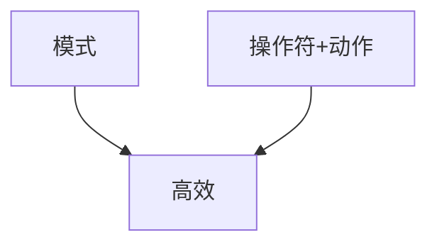

# <center>vim设计哲学</center>  


```mermaid
flowchart TD
模式-->高效
操作符+动作-->高效
```

## 配置  

```c
"vim.handleKeys": {
    "<C-c>": false,  // 退出vim
    "<C-a>": false,  // 数字自增
    "<C-x>": false,  // 数字自减
}
```
