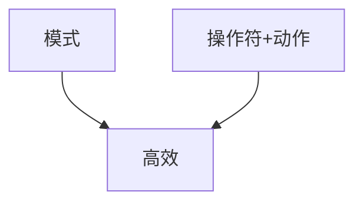

# <center>vim设计哲学</center>  



## 配置  

```c
// vim配置
"vim.easymotion": true, // 增强查找功能插件
"vim.incsearch": true, // 增强搜索功能插件
"vim.useSystemClipboard": true, // 使用系统剪贴板
"vim.useCtrlKeys": true, // 使用ctrl热键功能
"vim.hlsearch": true, // 设置搜索高亮
"vim.insertModeKeyBindings": [
    {
    "before": ["j", "j"],
    "after": ["<Esc>"]
    }
],
"vim.normalModeKeyBindingsNonRecursive": [
    {
    "before": ["<leader>", "d"],
    "after": ["d", "d"]
    },
    {
    "before": ["<C-n>"],
    "commands": [":nohl"]
    },
    {
    "before": ["K"],
    "commands": ["lineBreakInsert"],
    "silent": true
    }
],
"vim.leader": "<space>",
"vim.handleKeys": {
    "<C-c>": false,  // 退出vim
    "<C-a>": false,  // 数字自增
    "<C-x>": false,  // 数字自减
}
```
