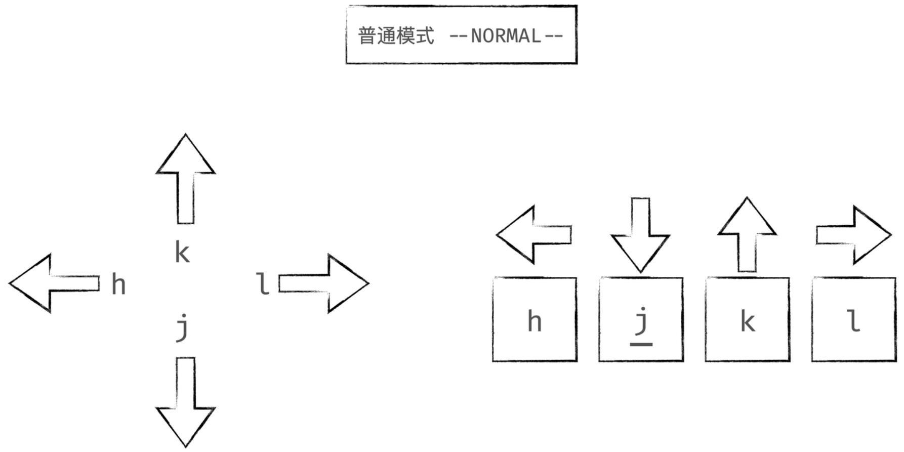

# 
vim光标移动
  

## 1、四个方向  

  

## 2、单词  

  

## 3、行  

  

**补充:**

* H：跳到页首  
* L：跳到页尾  
* M：跳到页中  
* num+gg：跳到指定某行  
* ctrl+e：逐行向下翻滚  
* ctrl+y：逐行向上翻滚  
* ctrl+f：逐页向下翻滚  
* ctrl+b：逐页向上翻滚  
* ctrl+d：逐半页向下翻滚  
* ctrl+u：逐半页向上翻滚  

## 4、当前行查找  

  
