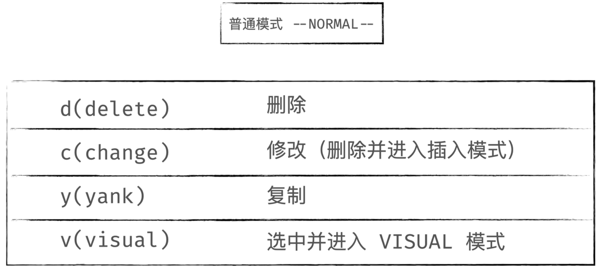

# 
vim操作符
  

  

## 1、d(delete)  

* x：删除当前字符并剪切到剪贴板  
* dw：删除单词并剪切到剪贴板  
* dd：删除本行并剪切到剪贴板  

## 2、c(change)  

* r：替换当前字符  
* cw：替换单词  
* cc：替换本行  

## 3、y(yank)  

* y：在使用v模式选定了某一块的时候，复制选定块到缓冲区用  
* yw：复制一个单词  
* yy：复制整行（nyy或者yny ，复制n行，n为数字）  

## 4、p(paste)  

* [p：粘贴到光标前  
* p或]p：粘贴到光标后  
