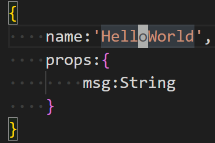
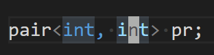

# 
vim动作+操作符样例
  

## 1、光标在一个单词上  

  

### 1）ciw：修改单词故进入插入模式  

### 2）diw：删除单词并保持正常模式  

### 3）yiw：复制单词并保持正常模式  

### 4）viw：选中一个单词  

## 2、光标在<>、()、{}、[]、``、''、""内  

  

### 1）ci<：修改<>里内容故进入插入模式  

### 2）di<：删除<>里内容并保持正常模式  

### 3）yi<：复制<>里内容并保持正常模式  

### 4）vi<：选中<>里内容  

### FAQ：其它同理  

### 注：()可用b替代，{}可用B替代  

## 3、修改删除复制2行  

### 1）2cc  

### 2）2dd  

### 3）2yy  

## 4、修改删除复制选中到‘s’  

### 1）cfs  

### 2）dfs  

### 3）yfs  

### 4）vfs  

### FAQ：同理可配套$、^、0使用  

## 5、修改删除复制选中整个文件  

### 1）cie  

### 2）die  

### 3）yie  

### 4）vie  

### 6、修改删除复制选中标签里内容（html）  

### 1）cit  

### 2）dit  

### 3）yit  

### 4）vit  

## 7、所有用i的地方都可以用a  
