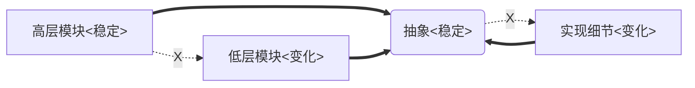
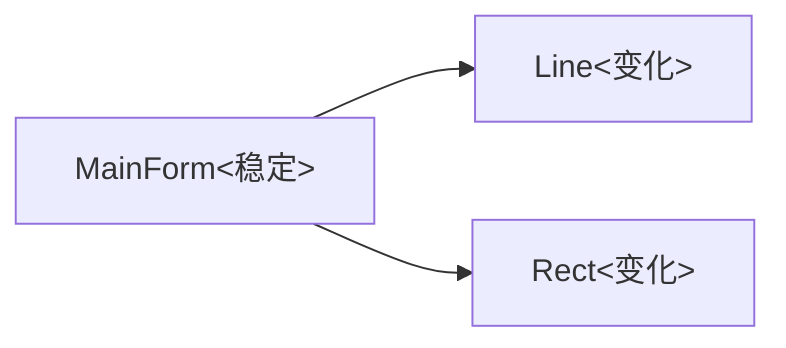
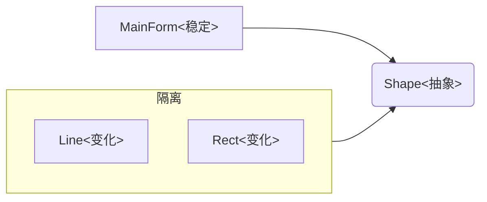
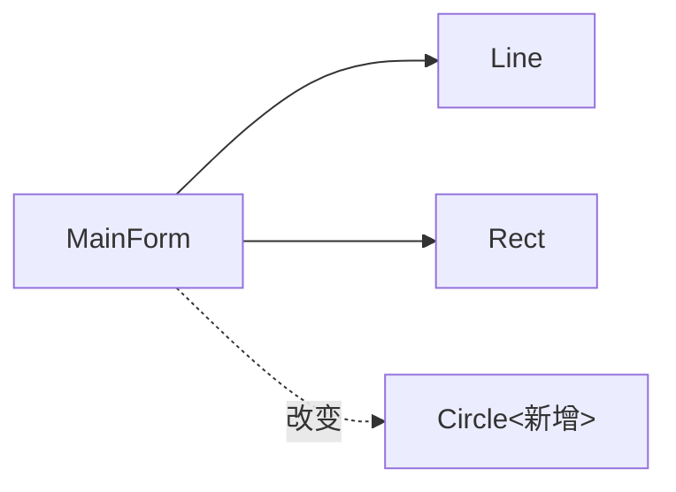
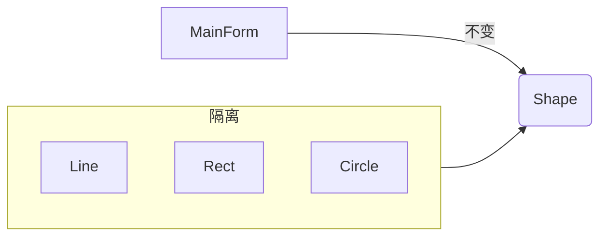
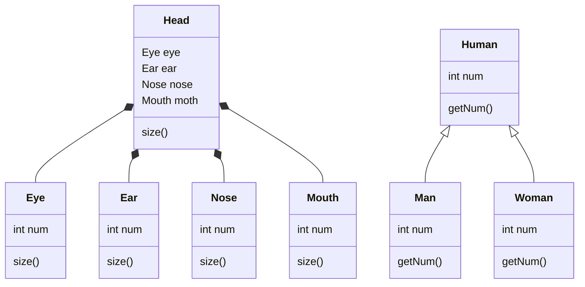

# 面向对象设计原则

## 一、关键词

### 1、变化&隔离&复用

* 变化是复用的天敌，隔离是为了将变化的影响减到最小。
* 面向对象编程就是为了抵御变化。

### 2、责任

面向对象编程的关键在于各负其责：

以在窗口中画各种图形为例：

* 面向过程：画图工具分别提供画直线、矩形、圆的功能。  
* 面向对象：直线、矩形、圆都是提供一个被画的接口给画图工具。  

## 二、八大设计原则

### 1、依赖倒置原则（DIP）

#### 1）全称：Dependence Inversion Principle

#### 2）含义

* 高层模块(稳定)不应该依赖于低层模块(变化)，二者都应该依赖于抽象(稳定)。
* 抽象(稳定)不应该依赖于实现细节(变化) ，实现细节应该依赖于抽象(稳定)。

#### 3）样例

以在窗口中画各种图形为例：

##### （1）面向过程设计

MainForm变得不稳定：

##### （2）面向对象设计

### 2、开放封闭原则（OCP）

#### 1）全称：Open Closed Principle，简称开闭原则

#### 2）含义

* 对扩展开放，对更改封闭。
* 类模块应该是可扩展的，但是不可修改。

#### 3）样例

以在窗口中画各种图形为例：

##### （1）面向过程设计

新增一个圆，MainForm也要随之发生改变：

##### （2）面向对象设计

新增一个圆，只需扩展一个Circle类即可。

### 3、单一职责原则（SRP）

#### 1）全称：Single responsibility principle

#### 2）含义

* 一个类应该仅有一个引起它变化的原因。
* 变化的方向隐含着类的责任。

### 4、里氏替换原则（LSP）

#### 1）全称：Liskov Substitution principle

#### 2）含义

* 子类必须能够替换它们的基类(IS-A)。
* 继承表达类型抽象。
  * 当发现父类（P）存在函数子类（S）不能用时，说明S不应该继承P，因为S不能完全表达（实现）P抽象出来的内容（接口）。

### 5、接口隔离原则（ISP）

#### 1）全称：Interface Segregation Principle

#### 2）含义

* 不应该强迫客户程序依赖它们不用的方法。
* 接口应该小而完备。

### 6、优先使用对象组合，而不是类继承

#### 1）含义

* 类继承通常为“白箱复用”，对象组合通常为“黑箱复用”。
* 继承在某种程度上破坏了封装性，子类父类耦合度高。
* 而对象组合则只要求被组合的对象具有良好定义的接口，耦合
度低。

#### 2）样例

### 7、封装变化点

#### 1）含义

* 使用封装来创建对象之间的分界层，让设计者可以在分界层的一侧进行修改，而不会对另一侧产生不良的影响，从而实现层次间的松耦合。

### 8、针对接口编程，而不是针对实现编程

#### 1）含义

* 不将变量类型声明为某个特定的具体类，而是声明为某个接口。
* 客户程序无需获知对象的具体类型，只需要知道对象所具有的接口。
* 减少系统中各部分的依赖关系，从而实现“高内聚、松耦合”的类型设计方案。

#### 2）思考

* 与“依赖倒置原则”相辅相成，违背了“依赖倒置原则”，往往也违背了“针对接口编程”。
* 产业强盛的标志：接口标准化。软件的核心其实就是分工合作。

## 三、将设计原则提升为设计经验

### 1、设计习语（Design Idioms）

* 描述与特定编程语言相关的低层模式，技巧，惯用法。
* 比如《Effective C++》、《More Effective C++》、《Exceptional C++》、《More Exceptional C++》

### 2、设计模式（Design Patterns）

* 主要描述的是“类与相互通信的对象之间的组织关系，包括它们的角色、职责、协作方式等方面。
* 主要解决变化中复用性的问题。

### 3、架构模式（Architectural Patterns）

* 描述系统中与基本结构组织关系密切的高层模式，包括子系统划分，职责，以及如何组织它们之间关系的规则。
* 系统级。
